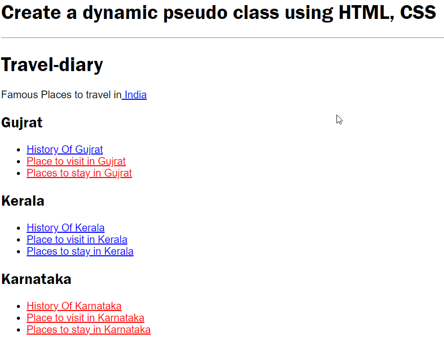

```
<h1>Create a dynamic pseudo class using HTML, CSS</h1>
<hr>

<!DOCTYPE html>
<html>
    <head>
        <meta charset="utf-8">
        <title>HTML CSS dynamic pseudo-class</title>
        <style>
            body {
                font-family: sans-serif;
            }
            
            h1, h2 {
                font-family: 'Franklin Gothic Medium', 'Arial Narrow', Arial, sans-serif;
            }
            
            a:link {
                color: red;
            }
            a:visited {
                color: blue;
            }
            a:hover { 
                background-color: rgb(122, 129, 138);
            }  
            a:active {
                background-color: rgb(255, 214, 255);
            } 
            a:focus {
                background-color: rgb(255, 214, 255);
            } 
        </style>
    </head>
    <body>
    
        <h1>Travel-diary</h1>
        
        <p>Famous Places to travel in<a href="https://www.tripadvisor.in/Attractions-g293860-Activities-India.html"> India</a></p>
        
        
        <h2>Gujrat</h2>
        <ul>
            <li>
                <a href="https://en.wikipedia.org/wiki/Gujarat">
                   History Of Gujrat
                </a>
            </li>
            <li>
                <a href="https://www.thomascook.in/india-tourism/places-to-visit-in-gujarat">
                    Place to visit in Gujrat</a>
            </li>
            <li>
                <a href="https://www.tripadvisor.in/Hotels-g297607-Gujarat-Hotels.html">
                    Places to stay in Gujrat</a>
            </li>
        </ul>


        <h2>Kerala</h2>
        <ul>
            <li>
                <a href="https://en.wikipedia.org/wiki/History_of_Kerala">
                   History Of Kerala
                </a>
            </li>
            <li>
                <a href="https://www.tripadvisor.in/Attractions-g297631-Activities-Kerala.html">
                    Place to visit in Kerala</a>
            </li>
            <li>
                <a href="https://www.tripadvisor.in/Hotels-g297631-Kerala-Hotels.html">
                    Places to stay in Kerala</a>
            </li>
        </ul>

        <h2> Karnataka</h2>
        <ul>
            <li>
                <a href="https://en.wikipedia.org/wiki/Karnataka">
                   History Of  Karnataka
                </a>
            </li>
            <li>
                <a href="https://www.holidify.com/state/karnataka/top-destinations-places-to-visit.html">
                    Place to visit in  Karnataka</a>
            </li>
            <li>
                <a href="https://www.thrillophilia.com/states/karnataka/stays">
                    Places to stay in  Karnataka</a>
            </li>
        </ul>
        
       
        
        

    </body>
</html>
```

### Output

