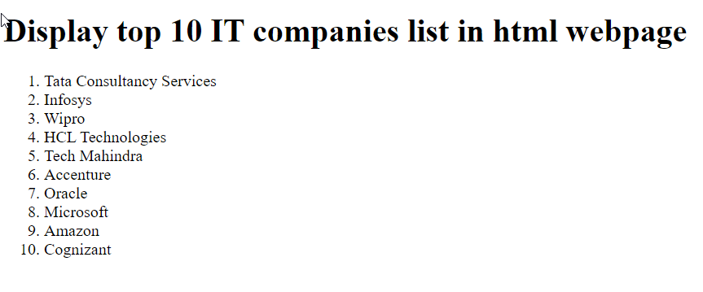

## Display top 10 IT companies list in html webpage

```
<!DOCTYPE html>
<html lang="en">
<head>
    <meta charset="UTF-8">
    <meta name="viewport" content="width=device-width, initial-scale=1.0">
    <title>Document</title>
</head>
<body>
  <h1>Display top 10 IT companies list in html webpage</h1>
  <ol>
    <li>Tata Consultancy Services</li>
    <li>Infosys</li>
    <li>Wipro</li>
    <li>HCL Technologies</li>
    <li>Tech Mahindra</li>
    <li>Accenture</li>
    <li>Oracle</li>
    <li>Microsoft</li>
    <li>Amazon</li>
    <li>Cognizant</li>

  </ol>
</body>
</html>
```

## Output
<hr>



