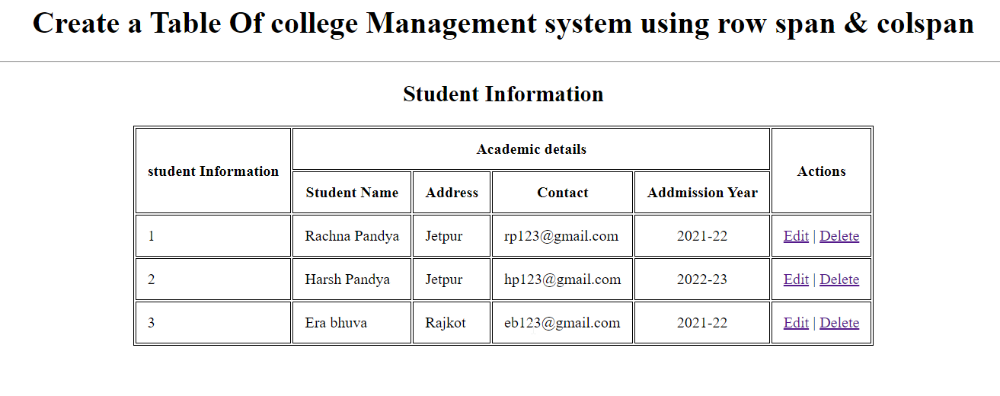

### Create a Table Of college Management system using row span & colspan
<hr>


```
<!DOCTYPE html>
<html lang="en">
<head>
    <meta charset="UTF-8">
    <meta name="viewport" content="width=device-width, initial-scale=1.0">
    <title>Table-Tag</title>
    <style>
        table,td,th {
            border: 1px solid black;
            
        }
        th,td{
            padding: 12px;
            text-align: "center";
        
        }
    </style>
</head>
<body>
    <h1 align = "center">Create a Table Of college Management system using row span & colspan</h1>
        <hr>
        <h2 align = "center">Student Information</h2>
        <table align = "center">
        <thead>
            <tr>
                <th rowspan="2">student Information</th>
                <th colspan="4">Academic details</th>
                <th rowspan="2">Actions</th>
            </tr>
            <tr>
                <th>Student Name</th>
                <th>Address</th>
                <th>Contact</th>
                <th>Addmission Year</th>
            </tr>
        </thead>
            <tr>
                <td rowspan="1">1</td>
                <td>Rachna Pandya</td>
                <td>Jetpur</td>
                <td>rp123@gmail.com</td>
                <td align ="center">2021-22</td>
                <td><a href="#">Edit</a> | <a href="#">Delete</a></td>
            </tr>
            <tr>
                <td rowspan="1">2</td>
                <td>Harsh Pandya</td>
                <td>Jetpur</td>
                <td>hp123@gmail.com</td>
                <td align ="center">2022-23</td>
                <td><a href="#">Edit</a> | <a href="#">Delete</a></td>
            </tr>
            <tr>
                <td rowspan="1">3</td>
                <td>Era bhuva</td>
                <td>Rajkot</td>
                <td>eb123@gmail.com</td>
                <td align ="center">2021-22</td>
                <td><a href="#">Edit</a> | <a href="#">Delete</a></td>
            </tr>
        </table>
        
       
</body>
</html>
```
## Output
<hr>


