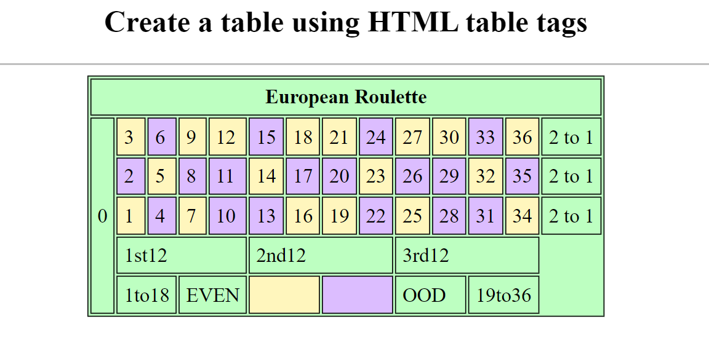

### Create a table using HTML table tags
<hr>

```
<!DOCTYPE html>
<html lang="en">
<head>
    <meta charset="UTF-8">
    <meta name="viewport" content="width=device-width, initial-scale=1.0">
    <title>Table Tag</title>
    <style>
        table,td,th {
            border: 1px solid black;
            /*border-collapse: collapse;*/
            }
        th,td{
            padding-top: 5px;
            padding-bottom: 5px;
            padding-right: 5px;
            padding-left: 5px;
        }
       
        
        
    </style>
</head>
<body>
    <table align="center" style="background-color: #bdffc1">
        <thead>
            <tr>
                <th colspan="14"> European Roulette </th>
            </tr>
        </thead>
        <tr>
            <td rowspan="5">0</td>
            <td style="background-color:#fff6bd">3</td>
            <td style="background-color:#dcbdff">6</td>
            <td style="background-color:#fff6bd">9</td>
            <td style="background-color: #fff6bd">12</td>
            <td style="background-color:#dcbdff">15</td>
            <td style="background-color:#fff6bd">18</td>
            <td style="background-color:#fff6bd">21</td>
            <td style="background-color:#dcbdff">24</td>
            <td style="background-color:#fff6bd">27</td>
            <td style="background-color:#fff6bd">30</td>
            <td style="background-color:#dcbdff">33</td>
            <td style="background-color:#fff6bd">36</td>
            <td>2 to 1</td>
        </tr>
        <tr>
            <td style="background-color:#dcbdff">2</td>
            <td style="background-color:#fff6bd">5</td>
            <td style="background-color:#dcbdff">8</td>
            <td style="background-color:#dcbdff">11</td>
            <td style="background-color:#fff6bd">14</td>
            <td style="background-color:#dcbdff">17</td>
            <td style="background-color:#dcbdff">20</td>
            <td style="background-color:#fff6bd">23</td>
            <td style="background-color:#dcbdff">26</td>
            <td style="background-color:#dcbdff">29</td>
            <td style="background-color:#fff6bd">32</td>
            <td style="background-color:#dcbdff">35</td>
            <td >2 to 1</td>
        </tr>
        <tr>
            <td style="background-color:#fff6bd">1</td>
            <td style="background-color:#dcbdff">4</td>
            <td style="background-color:#fff6bd">7</td>
            <td style="background-color:#dcbdff">10</td>
            <td style="background-color:#dcbdff">13</td>
            <td style="background-color:#fff6bd">16</td>
            <td style="background-color:#fff6bd">19</td>
            <td style="background-color:#dcbdff">22</td>
            <td style="background-color:#fff6bd">25</td>
            <td style="background-color:#dcbdff">28</td>
            <td style="background-color:#dcbdff">31</td>
            <td style="background-color:#fff6bd">34</td>
            <td>2 to 1</td>
        </tr>
        <tr>
            <td colspan="4" align="center">1st12</td>
            <td colspan="4">2nd12</td>
            <td colspan="4">3rd12</td>
        </tr>
        <tr>
            <td colspan="2">1to18</td>
            <td colspan="2">EVEN</td>
            <td colspan="2" style="background-color:#fff6bd">    </td>
            <td colspan="2" style="background-color: #dcbdff">    </td>
            <td colspan="2">OOD</td>
            <td colspan="2">19to36</td>

        </tr>
      
    </table>
</body>
</html>
```
<hr>

### Output

