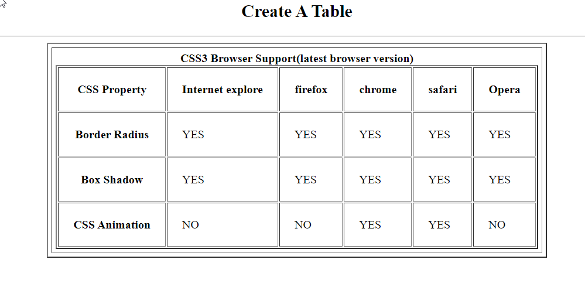

## Create A Table

```
<h2 align="center"> Create A Table </h2>
<hr>

<!DOCTYPE html>
<html lang="en">
<head>
    <meta charset="UTF-8">
    <meta name="viewport" content="width=device-width, initial-scale=1.0">
    <title>Table-Tag</title>
</head>
<body>
    <table border="2" align="center" cellspacing="5" cellpadding="5">
        <tr>
            <td align="center"><b>CSS3 Browser Support(latest browser version)</b>
                <table border="2" cellpadding="20">
                    <tr>
                        <th>CSS Property</th>
                        <th>Internet explore</th>
                        <th>firefox</th>
                        <th>chrome</th>
                        <th>safari</th>
                        <th>Opera</th>
                    </tr>
                    <tr>
                        <th>Border Radius</th>
                        <td>YES</td>
                        <td>YES</td>
                        <td>YES</td>
                        <td>YES</td>
                        <td>YES</td>
                    </tr>
                    <tr>
                        <th>Box Shadow</th>
                        <td>YES</td>
                        <td>YES</td>
                        <td>YES</td>
                        <td>YES</td>
                        <td>YES</td>
                    </tr>
                    <tr>
                        <th>CSS Animation</th>
                        <td>NO</td>
                        <td>NO</td>
                        <td>YES</td>
                        <td>YES</td>
                        <td>NO</td>
                    </tr>

                </table>


            </td>
        </tr>
       
    </table>
</body>
</html>
```

## Output
<hr>

