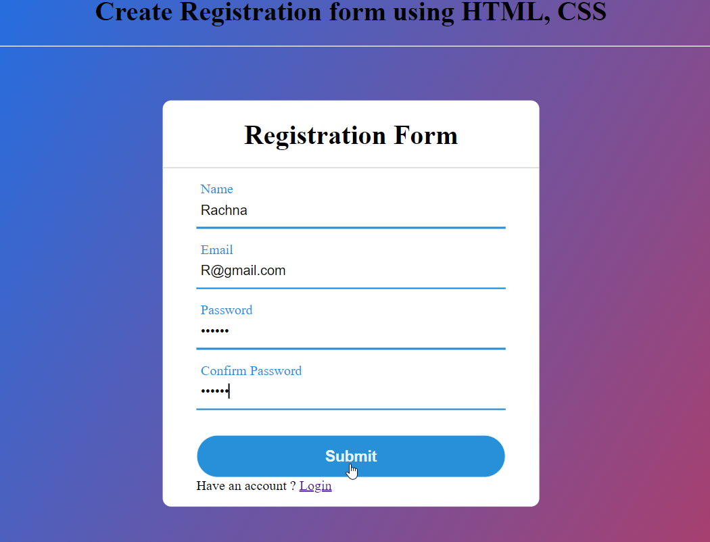

## Create Registration form using HTML, CSS

<hr>

```
<!DOCTYPE html>
<html lang="en">
<head>
    <meta charset="UTF-8">
    <meta name="viewport" content="width=device-width, initial-scale=1.0">
    <title>Registration form</title>
    <link rel="stylesheet" href="styles.css" />
</head>
<body>
    <div class="container">
        <div class="center">
    <h1>Registration Form</h1>
    <form action="POST" method="">
        <div class="txt_field">
            <input type="text" name="name" required>
            <span></span>
            <label>Name</label>
        </div>
        <div class="txt_field">
            <input type="email" name="email" required>
            <span></span>
            <label>Email</label>
        </div>
        <div class="txt_field">
            <input type="password" name="password" required>
            <span></span>
            <label>Password</label>
        </div>
        <div class="txt_field">
            <input type="password" name="password" required>
            <span></span>
            <label>Confirm Password</label>
        </div>
        <input name="submit" type="submit" vlaue="Sign up">
        <div class="signup-link">
            Have an account ? 
            <a href="#">Login</a>
        </div>
    </form>
    </div>
    </div>
</body>
</html>
```

<hr>

### Output



